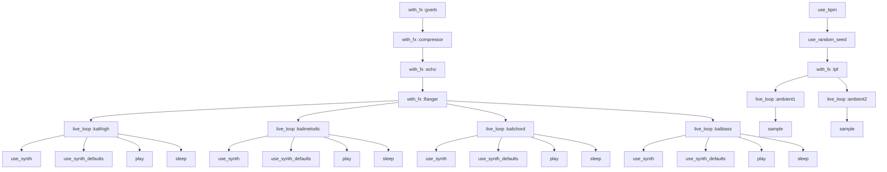

```mermaid
graph TD
    A[use_bpm]
    B[use_random_seed]
    C[with_fx :lpf]
    D[with_fx :gverb]
    E[with_fx :compressor]
    F[with_fx :echo]
    G[with_fx :flanger]
    
    A --> B
    B --> C
    C --> H[live_loop :ambient1]
    C --> I[live_loop :ambient2]
    D --> E
    E --> F
    F --> G
    G --> J[live_loop :kalihigh]
    G --> K[live_loop :kalimelodic]
    G --> L[live_loop :kalichord]
    G --> M[live_loop :kalibass]
    
    H --> N[sample]
    I --> O[sample]
    J --> P[use_synth]
    J --> Q[use_synth_defaults]
    J --> R[play]
    J --> S[sleep]
    
    K --> T[use_synth]
    K --> U[use_synth_defaults]
    K --> V[play]
    K --> W[sleep]
    
    L --> X[use_synth]
    L --> Y[use_synth_defaults]
    L --> Z[play]
    L --> AA[sleep]
    
    M --> AB[use_synth]
    M --> AC[use_synth_defaults]
    M --> AD[play]
    M --> AE[sleep]
```